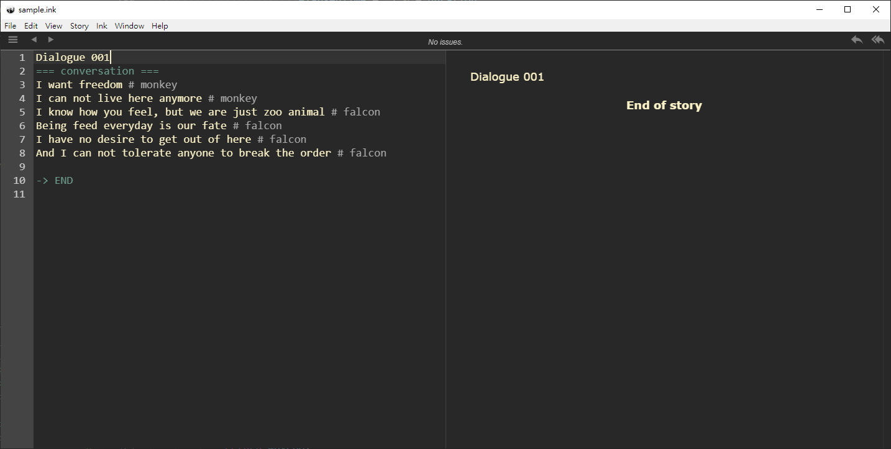

# Overview

# Folder Structure

- inky

# Inky

- [Writing web-based interactive fiction with ink](https://www.inklestudios.com/ink/web-tutorial/)
- [Making Dialogue with Inky and Unity Tutorial](https://www.youtube.com/watch?v=-nK-tQ_vc0Y)

The strict format of using inky in this project is like the following



```txt
Dialogue 001
=== conversation ===
I want freedom # monkey
I can not live here anymore # monkey
I know how you feel, but we are just zoo animal # falcon
Being feed everyday is our fate # falcon
I have no desire to get out of here # falcon
And I can not tolerate anyone to break the order # falcon 

-> END
```

Where the first line is the name of the cut scene

The second line has to be

```
=== conversation ===
```

Starting from the third line, there will be the conversation one line by another. The line ends with "#" symbol, and what comes after will be the name of the speaker.

When the conversation is finished, adding one blank line and "-> END" to next line of the blank line.

```

-> END
```

For this project, no branch of conversation is allowed and no choice is allowed.